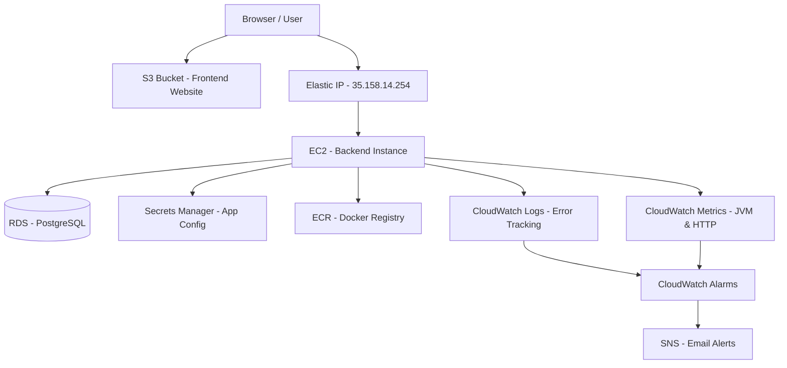

# AWS Architecture: IS-DevOps

## Overview
The `IS-DevOps` project provisions a multi-service architecture on **AWS (Amazon Web Services)** using **Terraform**. All resources are deployed to the `eu-central-1` (Frankfurt) region, leveraging a modular Infrastructure-as-Code (IaC) approach.

## Core Infrastructure Components

| Service | Module | Purpose |
|---------|--------|---------|
| **S3** | `s3/` | Hosts the frontend as a static website. |
| **EC2** | `ec2/` | `t3.micro` instance running the backend Docker container. |
| **RDS** | `rds/` | Managed `db.t3.micro` PostgreSQL 15 instance with gp3 storage and daily backups. |
| **ECR** | `ecr/` | Private container registry storing backend Docker images (MUTABLE tags, 5-image lifecycle). |
| **Secrets Manager** | `secrets-manager/` | Securely stores database and JWT runtime secrets. |
| **CloudWatch** | `cloudwatch/` | Error tracking, application metrics, log aggregation, and health alarms. |
| **SNS** | `cloudwatch/` | Email alert notifications for CloudWatch alarms. |
| **IAM** | `ec2/` | IAM Instance Profile granting the EC2 server least-privilege access. |
| **Elastic IP** | `ec2/` | Fixed public IP (`35.158.14.254`) associated with the backend server. |

## Network Architecture
- **RDS Management**: The PostgreSQL database resides in a private Subnet Group, making it inaccessible from the public internet. It accepts traffic strictly from the backend EC2 instance's Security Group.
- **S3 Standard Website**: The frontend S3 bucket is configured with public read access strictly for website content.

## Terraform Backend
We use **Remote State** management to ensure consistency across multiple developers and environments.
- **S3 Bucket**: `isteamx-devops-terraform-state-bucket` stores the `terraform.tfstate` file.
- **Configuration**: Defined in `terraform/backend.tf`.

## Resource Diagram

